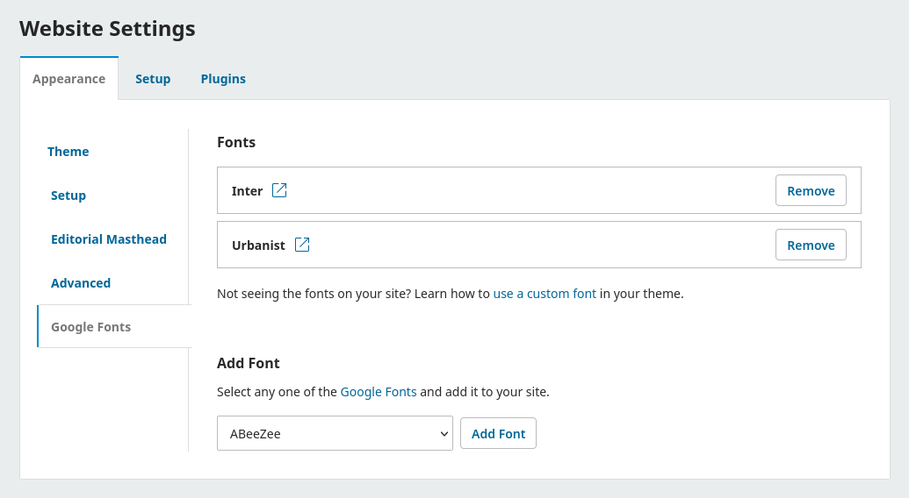

# Google Fonts

A plugin for  [OJS](https://pkp.sfu.ca/software/ojs/), [OMP](https://pkp.sfu.ca/software/omp/) or [OPS](https://pkp.sfu.ca/software/ops/) to use any [Google Font](https://fonts.google.com/) in your theme without compromising visitor privacy.



## How to Use

Once you have installed and enabled the plugin, follow these steps to add a font to your site.

1. Find a font that you want to use on [Google Fonts](https://fonts.google.com/).
2. Login to OJS, OMP or OPS as an Administrator or Editor.
3. Go to **Settings > Website > Appearance > Google Fonts**.
4. Select the font that you want to use from the dropdown list and click **Add Font**.
5. The font files will now load on your site. However, the **font won't show up** until it is assigned to items on your site using CSS. The section below describes the options available.

### Supported Themes

You can use a theme that already integrates with this plugin, like the [Individualize Theme by Publia](https://github.com/NateWr/individualizeTheme). When using one of these themes, you can select the fonts to use in the theme options at **Settings > Website > Appearance > Theme**.

### Custom CSS File

In OJS, OMP and OPS, you can upload a custom CSS file at **Settings > Website > Advanced > Journal style sheet**. The following CSS code will assign the **Inter** font to many elements in most themes:

```css
*,
*:before,
*:after {
  font-family: Inter, sans-serif;
}
```

The PKP Documentation provides further guidance for [creating a custom stylesheet](https://docs.pkp.sfu.ca/designing-your-journal/en/creating-stylesheet).

### Custom Theme Integration

Theme developers can integrate their themes with this plugin, so that editors can enable fonts in the plugin and assign them using Theme Options. The following steps show how to get the enabled fonts, create a theme option, and assign the font to a CSS variable.

Get the fonts enabled by this plugin.

```php
/** @var PluginSettingsDAO $pluginSettingsDao */
$pluginSettingsDao = DAORegistry::getDAO('PluginSettingsDAO');
$enabledFonts = $pluginSettingsDao->getSetting($contextId, 'googlefontsplugin', 'fonts');
```

Create a [Theme Option](https://docs.pkp.sfu.ca/pkp-theming-guide/en/theme-options-api) to select from the enabled fonts.

```php
if (is_array($enabledFonts)) {
  $this->theme->addOption('font', 'FieldSelect', [
    'label' => __('plugins.themes.myExampleTheme.option.font.label'),
    'description' => __('plugins.themes.myExampleTheme.option.font.description'),
    'options' => $enabledFonts,
    'default' => 'sans-serif',
  ]);
}
```

Add an [inline stylesheet](https://docs.pkp.sfu.ca/pkp-theming-guide/en/theme-api#addstyle) that assigns the font to a [CSS variable](https://developer.mozilla.org/en-US/docs/Web/CSS/Guides/Cascading_variables/Using_custom_properties) that can be used in the theme's stylesheets.

```php
if (is_array($enabledFonts) {
  $variables = '';
  foreach ($enabledFonts as $font) {
    if ($font['id'] === $this->theme->getOption('font')) {
      $variables = "--font: '{$font['family']}', sans-serif;";
      // Optional: check $font['category'] to determine whether
      // the selected font should have fallbacks for serif,
      // sans-serif, or monospace fonts.
    }
  }
  if ($variables) {
    $this->addStyle('variables', "body { {$variables} }", ['inline' => true, 'contexts' => ['frontend', 'htmlGalley']]);
  }
}
```

The theme's stylesheet should use the CSS variable throughout its stylesheets. The following example shows how to create and use variables.

```css
/* Set the theme's default font */
:root {
  --font: Inter, sans-serif;
}

body {
  font-family: var(--font);
}
```

## Contribute

Copy the `.env.example` file to `.env` and add your [Google Fonts API Key](https://developers.google.com/fonts/docs/developer_api#APIKey).

```
cp .env.example .env
```

Run the following [Node.js](https://nodejs.org) script to update the font list.

```
npm run get-fonts
```

## Package

Create a `.tar.gz` package of this plugin by running the following command in the directory above the plugin.

```
tar -czf googleFonts.tar.gz --exclude-ignore=.tarignore googleFonts
```

## Credits

This plugin was created thanks to funding from SLUB Dresden for the [Individualize Theme by Publia](https://github.com/NateWr/individualizeTheme).
